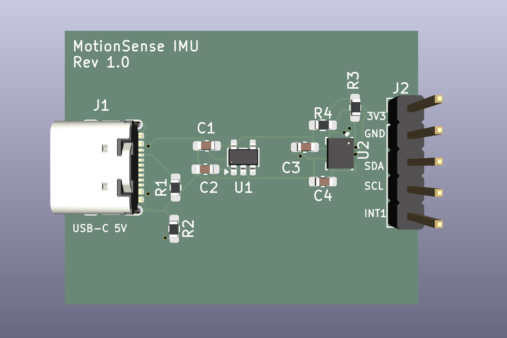
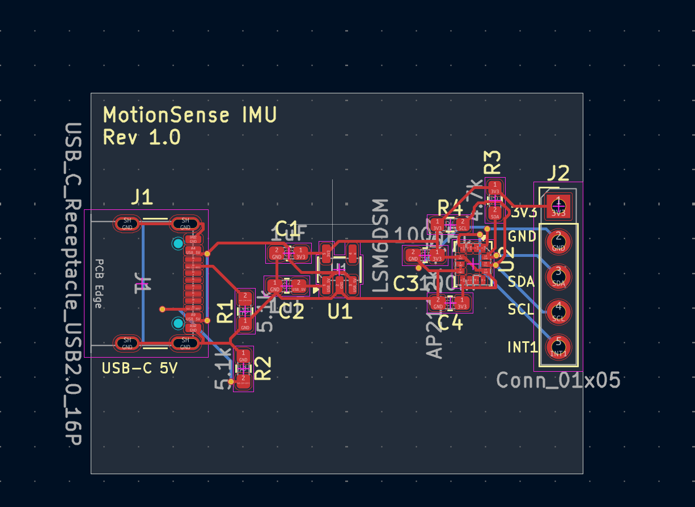

# MotionSense IMU

MotionSense IMU is a custom 2-layer PCB built around the ST LSM6DSM 6-axis accelerometer and gyroscope.

The board takes 5 V from USB-C, regulates it to 3.3 V, and breaks out the IMU's I2C interface and interrupt signal through a 5-pin header.

## Hardware

* LSM6DSM 6-axis accelerometer + gyroscope
* AP2112K-3.3 LDO regulator
* USB-C 5 V input
* 4.7 kΩ pull-up resistors on SDA and SCL
* Decoupling capacitors for the regulator and IMU
* 5-pin interface header
* 2-layer PCB
* Board size: approximately 35 mm × 27 mm

## Pinout

| Pin | Signal |
| --- | ------ |
| 1   | 3V3    |
| 2   | GND    |
| 3   | SDA    |
| 4   | SCL    |
| 5   | INT1   |

## Design

The schematic and PCB were designed in KiCad.

During routing, I experimented with Quilter and Freerouting before bringing the design back into KiCad for final cleanup and verification.

The final design passes KiCad DRC with:

* 0 violations
* 0 unconnected items

Gerber and drill files were also generated and inspected before manufacturing.

## PCB Layout

## Manufacturing

Rev 1 was submitted to JLCPCB for fabrication and assembly in August 2026.

Five PCBs were ordered, with two boards receiving component assembly.

The 1×5 J2 header is intentionally left unpopulated and will be soldered manually during bring-up.

## Files

* `MotionSense_IMU.kicad_pcb` — KiCad PCB layout
* `MotionSense_IMU.kicad_pro` — KiCad project
* `MotionSense_IMU.kicad_sch` — KiCad schematic
* `BOM.csv` — bill of materials
* `MotionSense_IMU_Rev1_Gerbers.zip` — Gerber and drill files
* `pcb_3D.png` — 3D board render
* `pcb_layout.png` — PCB layout image
* `schematic.png` — schematic image

## Current Status

**Rev 1 has been ordered for fabrication and assembly.**

The PCB design and manufacturing files are complete. The next stage is hardware bring-up and firmware validation once the assembled boards arrive.

## Bring-Up Plan

1. Inspect the assembled board for soldering or placement issues.
2. Solder the J2 header.
3. Check for shorts between 3.3 V and GND.
4. Power the board through USB-C.
5. Verify the 5 V input and 3.3 V regulator output with a multimeter.
6. Connect an ESP32 to SDA, SCL, and GND.
7. Detect the LSM6DSM over I2C.
8. Read the `WHO_AM_I` register to confirm communication.
9. Read live accelerometer and gyroscope data.
10. Test the INT1 interrupt output.

## Next Steps

* Prepare ESP32 bring-up firmware
* Complete electrical testing
* Validate accelerometer and gyroscope measurements
* Test interrupt functionality
* Document test results
* Record any changes needed for Rev 2

## Project Goal

The goal of this project is to work through the complete PCB development process, from schematic capture and component selection through layout, manufacturing, assembly, and hardware validation.
