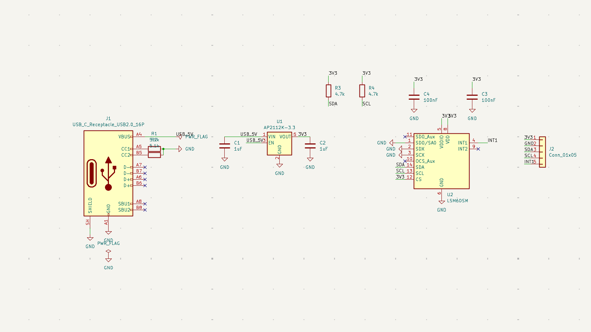

# MotionSense IMU

MotionSense IMU is a small 2-layer PCB I designed around the ST LSM6DSM accelerometer and gyroscope.

The board takes 5 V from USB-C, regulates it to 3.3 V, and breaks out the IMU's I2C signals and interrupt pin through a 5-pin header.

## Hardware

- LSM6DSM 6-axis IMU
- AP2112K-3.3 voltage regulator
- USB-C 5 V input
- 4.7 kΩ pull-up resistors on SDA and SCL
- Decoupling capacitors for the regulator and IMU
- 5-pin output header

Board size: approximately 35 mm × 27 mm.

## Pinout

| Pin | Signal |
|---|---|
| 1 | 3V3 |
| 2 | GND |
| 3 | SDA |
| 4 | SCL |
| 5 | INT1 |

## Design Process

I designed the schematic and PCB in KiCad.

For placement and routing, I experimented with Quilter and Freerouting, then brought the design back into KiCad for cleanup and design-rule checking.

The final layout passes KiCad DRC with:

- 0 violations
- 0 unconnected items

I also generated the Gerber and drill files and checked them in KiCad GerbView before packaging them for fabrication.

## Schematic

The editable KiCad schematic is included in the repository:

[View `MotionSense_IMU.kicad_sch`](MotionSense_IMU.kicad_sch)

## PCB Layout

## Files

- `MotionSense_IMU.kicad_sch` — schematic source
- `MotionSense_IMU.kicad_pcb` — PCB layout
- `MotionSense_IMU.kicad_pro` — KiCad project
- `BOM.csv` — bill of materials
- `MotionSense_IMU_Rev1_Gerbers.zip` — Gerber and drill files
- `schematic.png` — schematic preview
- `pcb_3D.png` — 3D board render
- `pcb_layout.png` — PCB layout screenshot

## Fabrication Files

[Download Gerber + drill files](MotionSense_IMU_Rev1_Gerbers.zip)

The fabrication package includes the top and bottom copper, solder mask, front silkscreen, board outline, and plated and non-plated drill files.

## Current Status

The PCB design and fabrication files are complete.

The board has not been physically assembled or tested yet.

## Next Steps

- Order the PCB
- Assemble the components
- Verify the 5 V input and 3.3 V rail
- Connect a microcontroller over I2C
- Read accelerometer and gyroscope data
- Test the INT1 output
- Document any changes needed for Rev 2
